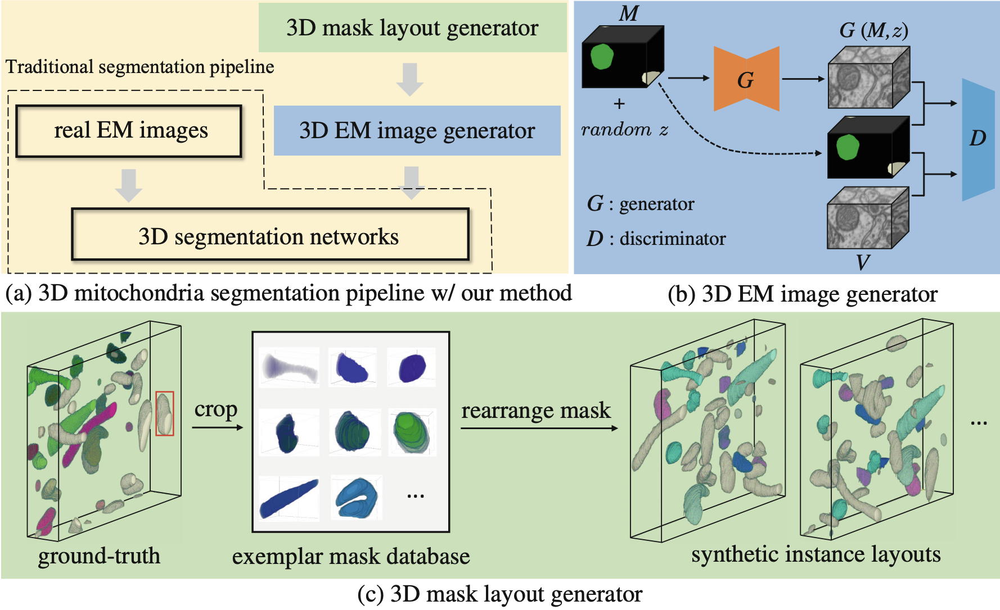

## Mask Rearranging Data Augmentation for 3D Mitochondria Segmentation (MICCAI 2022)

MRDA is a data augmentation method for 3D mitochondria segmentation by synthesizing diverse 3D EM images.



## Paper
This repository provides the official implementation of MRDA.

<b>Mask Rearranging Data Augmentation for 3D Mitochondria Segmentation</b> <br/>
[Qi Chen](https://scholar.google.com/citations?user=4Q5gs2MAAAAJ&hl=en&scioq=Qi+Chen+ustc)<sup>1</sup>, [Mingxing Li](https://scholar.google.com/citations?user=-pfkprkAAAAJ&hl=en)<sup>1</sup>, [Jiacheng Li](http://home.ustc.edu.cn/~jclee/)<sup>1</sup>,  Bo Hu<sup>1</sup>, [Zhiwei Xiong](http://staff.ustc.edu.cn/~zwxiong/)<sup>1</sup>, <br/>
<sup>1 </sup>University of Science and Technology of China<br/>
[paper](https://link.springer.com/content/pdf/10.1007/978-3-031-16440-8_4.pdf) | [code](https://github.com/qic999/MRDA_MitoSeg) | slides | poster 

## ⏳ Dataset Link
- [Lucchi](https://www.epfl.ch/labs/cvlab/data/data-em/)
- [MitoEM](https://mitoem.grand-challenge.org/)


## 💡 Acknowledgement
This project is built upon numerous previous projects. Especially, we'd like to thank the contributors of the following github repositories:
- [Pix2Pix](https://github.com/junyanz/pytorch-CycleGAN-and-pix2pix)
- [MitoEM2021-Challenge](https://github.com/Limingxing00/MitoEM2021-Challenge)
- [pytorch_connectomics](https://github.com/zudi-lin/pytorch_connectomics)

## 🛡️ License
This project is under the CC-BY-NC 4.0 license. See [LICENSE](LICENSE) for details.

## 📦 Citation
If you find this work or code is helpful in your research, please cite:
```
@inproceedings{chen2022mask,
  title={Mask Rearranging Data Augmentation for 3D Mitochondria Segmentation},
  author={Chen, Qi and Li, Mingxing and Li, Jiacheng and Hu, Bo and Xiong, Zhiwei},
  booktitle={Medical Image Computing and Computer Assisted Intervention--MICCAI 2022: 25th International Conference, Singapore, September 18--22, 2022, Proceedings, Part IV},
  pages={36--46},
  year={2022},
  organization={Springer}
}
```


